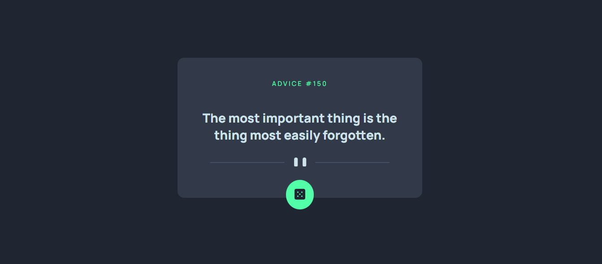

# Frontend Mentor - Advice generator app solution

This is a solution to the [Advice generator app challenge on Frontend Mentor](https://www.frontendmentor.io/challenges/advice-generator-app-QdUG-13db). Frontend Mentor challenges help you improve your coding skills by building realistic projects.

## Table of contents

- [Overview](#overview)
  - [The challenge](#the-challenge)
  - [Screenshot](#screenshot)
  - [Links](#links)
- [My process](#my-process)
  - [Built with](#built-with)
  - [What I learned](#what-i-learned)
  - [Continued development](#continued-development)
  - [Useful resources](#useful-resources)
- [Author](#author)
- [Acknowledgments](#acknowledgments)

## Overview

### The challenge

Users should be able to:

- View the optimal layout for the app depending on their device's screen size
- See hover states for all interactive elements on the page
- Generate a new piece of advice by clicking the dice icon
- Also Generate a new piece of advice when the window loads.

### Screenshot

### Links

- Solution URL: [Add solution URL here](https://www.frontendmentor.io/solutions/advice-generator-app-xahkdXYfbU)
- Live Site URL: [Advice Generator App](https://ellaboevans.github.io/Advice-Generator-App/)

## My process

### Built with

- Semantic HTML5 markup
- CSS custom properties
- Flexbox
- CSS Grid
- JavaScript

### What I learned

1. I learned how to position a button but on top of the edge of a card 
2. Create Design Resonsiveness
4. Fetch Resutls using APIs

### Continued development

I am still building more complex project to enhance my tech stack.
### Useful resources

- [W3schools](https://www.w3schools.com) - This website helped me to understand the basics of fetch API
- [JavaScript-info](https://www.javascript.info) - I take most of my JavaScript lessons from here. 

## Author

- Frontend Mentor - [@ellaboevans](https://www.frontendmentor.io/profile/eelabo)
- Twitter - [@theEvansElabo_](https://www.twitter.com/theevanselabo_)
- LinkedIn - [@evans-elabo](https://www.linkedin.com/in/evans-elabo)

## Acknowledgments

I am very grateful to have access to articles, stack overflow, and many more on the internet. I would like to thank each and everyone who has contributed to help us gain knowledge in whatever we do with the web.
